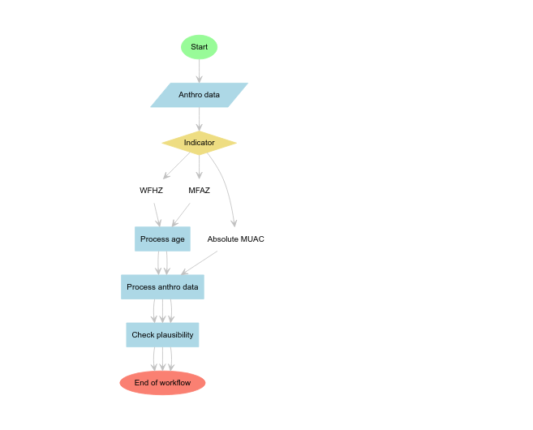

<!-- README.md is generated from README.Rmd. Please edit that file -->

# `mwana`: Utilities for analysing children’s nutritional status

<!-- badges: start -->

[](https://www.repostatus.org/#wip)
[](https://lifecycle.r-lib.org/articles/stages.html#experimental)
[](https://github.com/nutriverse/mwana/actions/workflows/pages/pages-build-deployment)
[](https://github.com/nutriverse/mwana/actions/workflows/R-CMD-check.yaml)
[](https://github.com/nutriverse/mwana/actions/workflows/test-coverage.yaml)
[](https://codecov.io/gh/nutriverse/mwana)
[](https://www.codefactor.io/repository/github/nutriverse/mwana)
<!-- badges: end -->

Child anthropometric assessments, implemented routinely in most
countries worldwide, are the cornerstones of child nutrition and food
security surveillance around the world. Ensuring the quality of child
anthropometric data, the accuracy of child undernutrition prevalence
estimates, and the timeliness of reporting is therefore critical in
establishing accurate, robust, and up-to-date child undernutrition
status globally.

`mwana`, term for *child* in *Elómwè*, a local language spoken in the
central-northern regions of Mozambique, and also a word with a similar
meaning across other Bantu languages (such as Swahili) spoken in many
parts of Africa, is a package that streamlines child anthropometry data
quality checks and undernutrition prevalence estimation for children
6-59 months old through comprehensive implementation of the SMART
Methodology guidelines in R.

## Motivation

`mwana` was borne out of the author’s own experience of having to work
with multiple child anthropometric datasets to conduct data quality
appraisal and prevalence estimation as part of the data quality
assurance team of the Integrated Phase Classification (IPC). The current
standard child anthropometric data appraisal workflow is extremely
cumbersome requiring significant time and effort utilising different
software tools (SPSS, Excel, Emergency Nutrition Assessment or ENA
software) for each step of the process for a single dataset. This
process is repeated for every dataset needing to be processed and often
needing to be implemented in a relatively short period time. This manual
and repetitive process, by its nature, is extremely error-prone.

`mwana`, which is primarily an R-based implementation of the ENA for
SMART software, simplifies this cumbersome workflow into a programmable
process particularly when handling large multiple datasets.

> [!NOTE]
>
> `mwana` was made possible thanks to the state-of-the-art work in
> nutrition survey guidance led by the [SMART
> initiative](https://smartmethodology.org). Under the hood, `mwana`
> bundles the SMART guidance through the use of the National Information
> Platforms for Nutrition Anthropometric Data Toolkit (nipnTK)
> functionalities in `R` to build its handy function around plausibility
> checks. Click [here](https://github.com/nutriverse/nipnTK) to learn
> more about the `nipnTK` package.

## What does `mwana` do?

It automates plausibility checks and prevalence analyses and respective
summaries of the outputs.

### Plausibility checks.

- `mwana` performs plausibility checks on weight-for-height z-score
  (WFHZ)-based data by mimicking the SMART plausibility checkers in ENA
  for SMART software, their scoring and classification criterion.

- It performs, as well, plausibility checks on MUAC data. For this,
  `mwana` integrates recent advances in using MUAC-for-age z-score
  (MFAZ) for auditing the plausibility of MUAC data. In this way, when
  the variable age is available: `mwana` performs plausibility checks
  similar to those in WFHZ, however with few differences in the scoring.
  Otherwise, when the variables age is missing, a similar test suit used
  in the current version of ENA is performed. Read details here.

#### A useful workflow for plausibility check using `mwana`



### Prevalence analysis

`mwana` prevalence calculators were built to take decisions on the
appropriate analysis procedure to follow based on the quality of the
data, as per the SMART rules. It returns an output table with the
appropriate results based on the data quality test results.
Fundamentally, the calculators loop over the survey areas in the dataset
whilst performing quality appraisal and taking decisions on the
appropriate prevalence analysis procedure to follow on the basis of the
result.

`mwana` computes prevalence for:

- Wasting on the basis of WFHZ and/edema (Read vignettes)
- Wasting on the basis of the raw MUAC values and/or edema: here, when
  variable age is available, mwana applies MFAZ flags, otherwise it
  applies the flagging criteria around the raw MUAC values, to exclude
  outliers before computing prevalence, but the actual prevalence is
  done on the raw values. (Read link to the specific section in the
  vignettes)
- Wasting on the basis of MFAZ and/edema: outliers excluded using MFAZ
  flags. (Read link to the specific section in the vignettes)
- Combined prevalence of wasting: here a concept of combined flags is
  used to streamline the flags removed in WFHZ and those in MUAC. (Read
  link to the specific section in the vignettes).

`mwana` provides weighted prevalence analysis, if needed. And this is
controlled by the user. This is possible in all calculators, including
for MUAC, combined, which is not currently available in ENA for SMART.

In the context of IPC Acute Malnutrition (IPC AMN) analysis workflow,
`mwana` provides a handy function for checking if the minimum sample
size requirements in a given area were met on the basis of the
methodology used to collect the data: survey, screening or sentinel
sites. (Check out the vignette).

> [!TIP]
>
> If you are undertaking a research and you want to wrangle your data
> before including in your statistical models, etc, `mwana` is a great
> helper.

> [!WARNING]
>
> Please note that `mwana` is still highly experimental and is
> undergoing a lot of development. Hence, any functionalities described
> below have a high likelihood of changing interface or approach as we
> aim for a stable working version.

## Installation

`mwana` is not yet on CRAN but can be installed from the [nutriverse R
Universe](https://nutriverse.r-universe.dev) as follows:

``` r
install.packages(
  "mwana",
  repos = c('https://nutriverse.r-universe.dev', 'https://cloud.r-project.org')
)
```

Then load to in memory with

``` r
library(ipccheckr)
```

# Citation

If you were enticed to use `mwana` package and found it useful, please
cite using the suggested citation provided by a call to `citation`
function as follows:

``` r
citation("ipccheckr")
```

    To cite ipccheckr: in publications use:

      Tomás Zaba, Ernest Guevarra (2024). _ipccheckr: Toolkit for
      Performing IPC Acute Malnutrition-related Data Checks_. R package
      version 0.0.0.9000, <https://github.com/tomaszaba/ipccheckr>.

    A BibTeX entry for LaTeX users is

      @Manual{,
        title = {ipccheckr: Toolkit for Performing IPC Acute Malnutrition-related Data Checks},
        author = {{Tomás Zaba} and {Ernest Guevarra}},
        year = {2024},
        note = {R package version 0.0.0.9000},
        url = {https://github.com/tomaszaba/ipccheckr},
      }

# Community guidelines

Feedback, bug reports and feature requests are welcome; file issues or
seek support [here](https://github.com/nutriverse/mwana/issues). If you
would like to contribute to the package, please see our [contributing
guidelines](https://nutriverse.io/mwana/CONTRIBUTING.html).

This project is releases with [Contributor Code of
Conduct](https://nutriverse.io/mwana/CODE_OF_CONDUCT.html). By
participating in this project you agree to abide by its terms.
