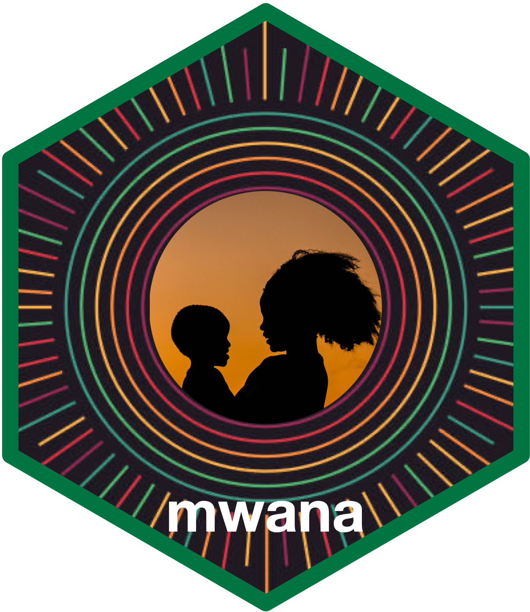

<!-- README.md is generated from README.Rmd. Please edit that file -->

# mwana: An efficient workflow for plausibility checks and prevalence analysis of wasting in R 

<!-- badges: start -->

[](https://www.repostatus.org/#wip)
[](https://lifecycle.r-lib.org/articles/stages.html#experimental)
[](https://github.com/nutriverse/mwana/actions/workflows/pages/pages-build-deployment)
[](https://github.com/nutriverse/mwana/actions/workflows/R-CMD-check.yaml)
[](https://github.com/nutriverse/mwana/actions/workflows/test-coverage.yaml)
[](https://codecov.io/gh/nutriverse/mwana)
[](https://www.codefactor.io/repository/github/nutriverse/mwana)
[](https://zenodo.org/badge/latestdoi/867609177)
<!-- badges: end -->

Child anthropometric assessments are the cornerstones of child nutrition
and food security surveillance around the world. Ensuring the quality of
data from these assessments is paramount to obtaining accurate child
under nutrition prevalence estimates. The timeliness of reporting is, as
well, critical to allowing timely situation analyses and responses to
tackle the needs of the affected population.

The `mwana` package streamlines data quality checks of and acute
undernutrition prevalence estimation from anthropometric data of
children aged 6 to 59 months old. This is made possible through the many
years of leadership and development work in nutrition surveys of the
[SMART initiative](https://smartmethodology.org) through its [nutrition
survey
guidance](https://smartmethodology.org/survey-planning-tools/smart-methodology/)
which `mwana` builds upon as a development framework. The main
functionalities of the `mwana` package on acute undernutrition data
quality checks are mainly convenience wrappers to functions in the
[`nipnTK`](https://nutriverse.io/nipnTK) package.

## Motivation

`mwana` was borne out of the author’s own experience of having to work
with multiple child anthropometric data sets to conduct data quality
appraisal and prevalence estimation as part of the ***Quality Assurance
Team*** of the [Integrated Phase Classification
(IPC)](https://www.ipcinfo.org/) Global Support Unit. The current
standard child anthropometric data appraisal workflow is extremely
cumbersome, requiring significant time and effort utilizing different
software tools - SPSS, Microsoft Excel, [SMART Emergency Nutrition
Assessment (ENA)
software](https://smartmethodology.org/survey-planning-tools/smart-emergency-nutrition-assessment/) -
for each step of the process for a single dataset. This process is
repeated for every data set needing to be processed and often needing to
be implemented in a relatively short period of time. This manual and
repetitive process, by its nature, is extremely error-prone.

`mwana` provides functions that can simplify this cumbersome workflow
into a process that can be programmatically designed particularly when
handling multiple-area datasets. Whilst developed with the analytic and
reporting needs of the IPC Global Support Unit in mind, `mwana` can be
used generally for anthropometric datasets of children for the purpose
of assessing data quality and for estimating prevalence of acute
undernutrition in children 6-59 months old.

## Installation

`mwana` is not yet on CRAN but can be installed from the [nutriverse R
Universe](https://nutriverse.r-universe.dev) as follows:

``` r
install.packages(
  "mwana",
  repos = c('https://nutriverse.r-universe.dev', 'https://cloud.r-project.org')
)
```

then loaded into the current environment via

``` r
library(mwana)
```

## What does `mwana` do?

Currently,
`mwana` has the following functionalities that support the creation of a
programmatic workflow described in the figure to the left.

### 1. Data plausibility checks of acute undernutrition anthropometric data of children 6-59 months old

`mwana` has functions for performing data plausibility checks on
weight-for-height z-score (WFHZ) data based on the SMART plausibility
checkers, data quality scoring, and data quality classification
implemented by the ENA for SMART software, their scoring and
classification criterion. To learn more about these WFHZ plausibility
checks, the functions that implement them, and how to use these
function, read this
[guide](https://nutriverse.io/mwana/articles/plausibility.html#plausibility-check-on-wfhz-data).

`mwana` also has functions for performing data plausibility checks on
mid-upper arm circumference (MUAC) data based on recent research and
recommendations on MUAC-for-age z-score (MFAZ) and its utility for data
plausibility checks of MUAC data. To learn more about these MUAC
plausibility checks, the functions that implement them, and how to use
these functions, read this
[guide](https://nutriverse.io/mwana/articles/plausibility.html#plausibility-check-on-mfaz-data).

### 2. Prevalence estimation of acute undernutrition

`mwana` has prevalence estimators developed to take into account SMART
guidelines on estimation approach to use based on an assessment of data
quality. These functions accept input datasets that include multiple
survey domains and return summary output tables with prevalence
estimates for each survey domain.

- To read about the functions and the process for estimating acute
  undernutrition prevalence from WFHZ and/or edema data, read this
  [guide](https://nutriverse.io/mwana/articles/prevalence.html#sec-prevalence-wfhz).

- To read about the functions and the process for estimating acute
  undernutrition prevalence from MUAC data, read this
  [guide](https://nutriverse.io/mwana/articles/prevalence.html#sec-prevalence-muac)
  on using unadjusted MUAC and/or edema data and this
  [guide](https://nutriverse.io/mwana/articles/prevalence.html#estimation-of-the-prevalence-of-wasting-based-on-mfaz)
  on using MFAZ and/or edema data.

- To read about functions and the process for estimating combined acute
  undernutrition prevalence, read this
  [guide](https://nutriverse.io/mwana/articles/prevalence.html#estimation-of-the-combined-prevalence-of-wasting).

### 3. Sample size checker

`mwana` provides a handy function for checking whether a specific
anthropometric dataset has met the minimum sample size requirements for
each of the dataset’s domains. The function assesses this sample size
requirement based on whether the dataset was collected through a survey,
a screening exercise, or a sentinel site surveillance. To learn more
about this function, read this
[guide](https://nutriverse.io/mwana/articles/ipc_amn_check.html).

### 4. Reporting of data plausibility checks and prevalence estimation summary outputs

`mwana` has helper functions that process summary output tables and turn
them into presentation and/or report ready tables.

> [!TIP]
>
> If you are undertaking research using anthropometric data of children
> 6-59 months old with a focus on acute undernutrition, `mwana` has
> functions to wrangle ***weight***, ***height***, ***age***,
> ***WFHZ***, ***MUAC***, and ***MFAZ*** data before using it in your
> models.

## Citation

If you use `mwana` package in your work, please cite using the suggested
citation provided by a call to `citation()` function as follows:

``` r
citation("mwana")
#> To cite mwana: in publications use:
#> 
#>   Tomás Zaba, Ernest Guevarra (2024). _mwana: Utilities for Analysing
#>   Children's Nutritional Status_. R package version 0.0.0.9000,
#>   <https://github.com/nutriverse/mwana>.
#> 
#> A BibTeX entry for LaTeX users is
#> 
#>   @Manual{,
#>     title = {mwana: Utilities for Analysing Children's Nutritional Status},
#>     author = {{Tomás Zaba} and {Ernest Guevarra}},
#>     year = {2024},
#>     note = {R package version 0.0.0.9000},
#>     url = {https://github.com/nutriverse/mwana},
#>   }
```

# Community guidelines

Feedback, bug reports and feature requests are welcome; file issues or
seek support [here](https://github.com/nutriverse/mwana/issues). If you
would like to contribute to the package, please see our [contributing
guidelines](https://nutriverse.io/mwana/CONTRIBUTING.html).

This project is released with a [Contributor Code of
Conduct](https://nutriverse.io/mwana/CODE_OF_CONDUCT.html). By
participating in this project you agree to abide by its terms.
